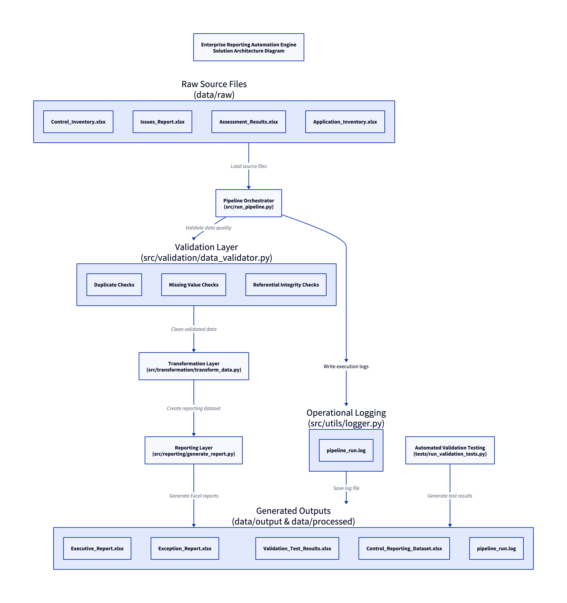
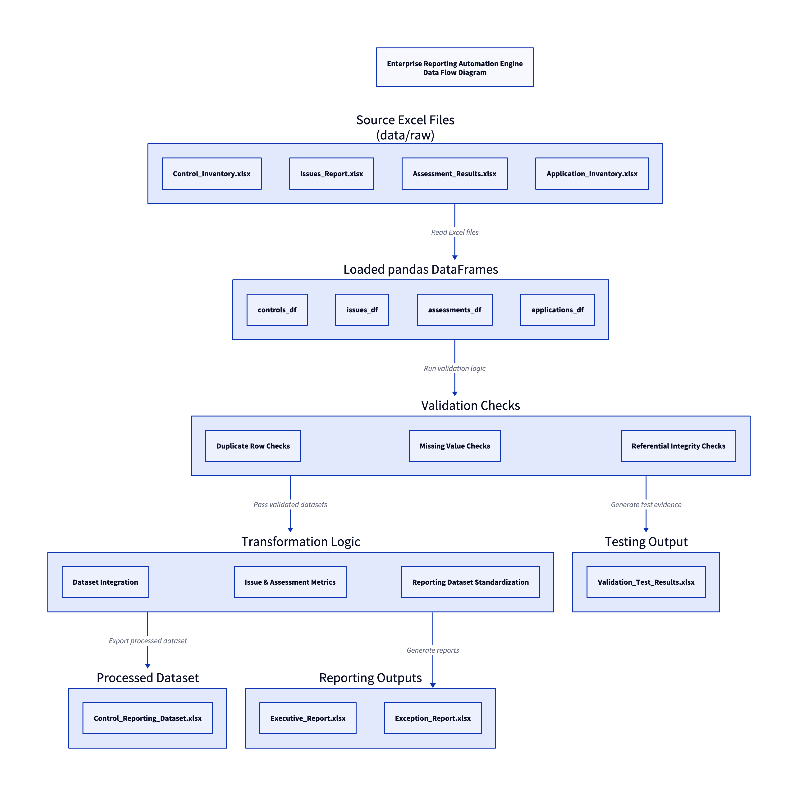
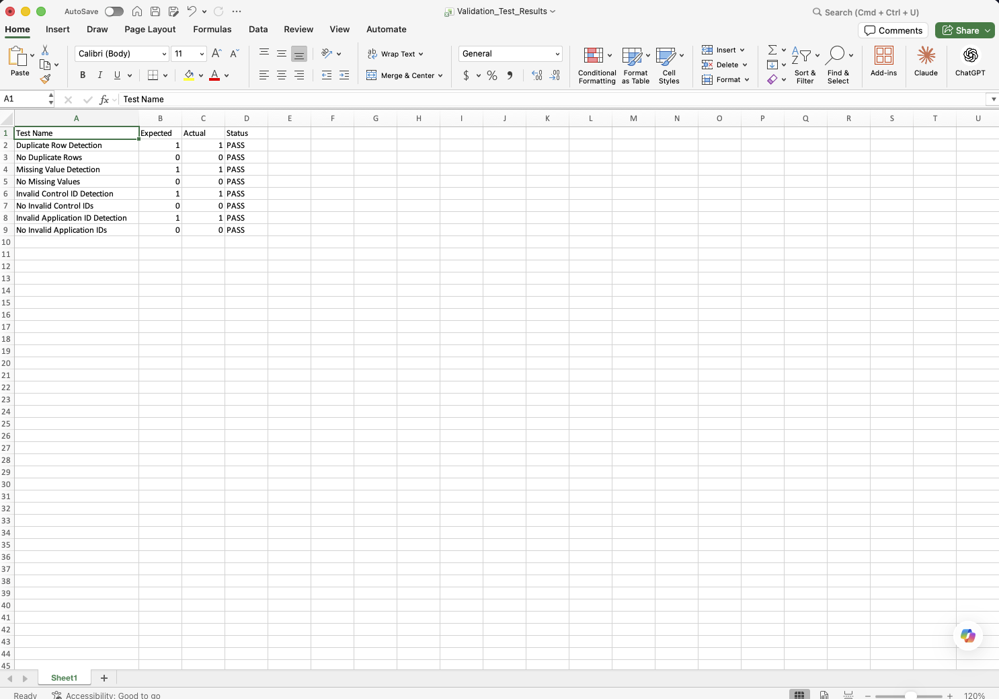
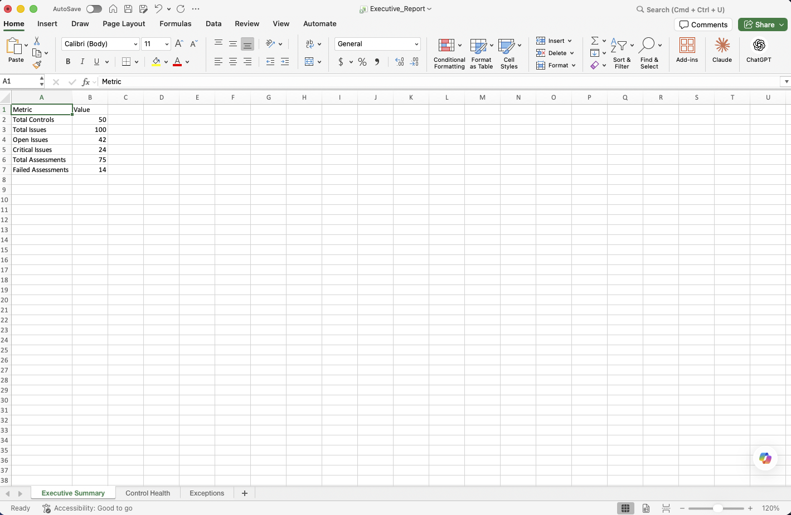
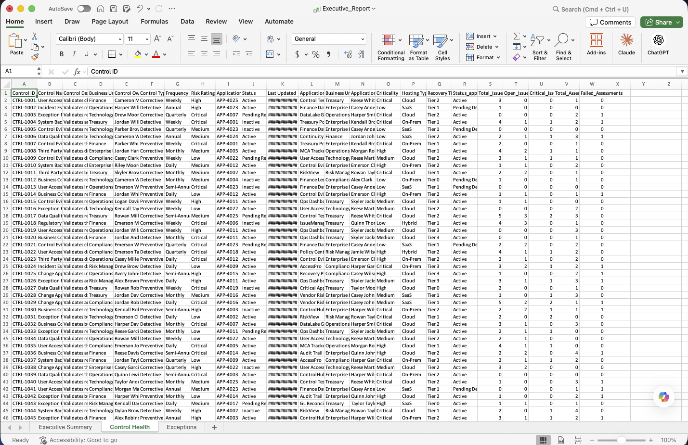
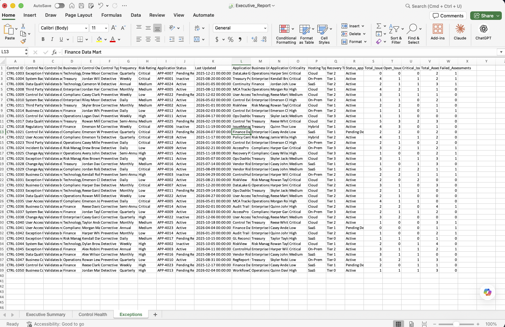
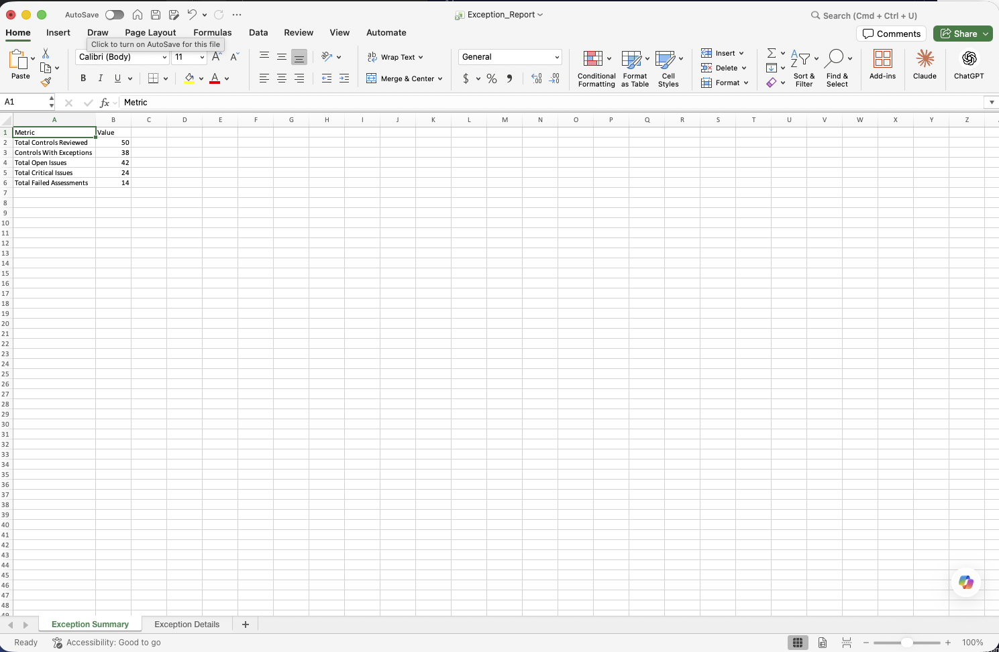
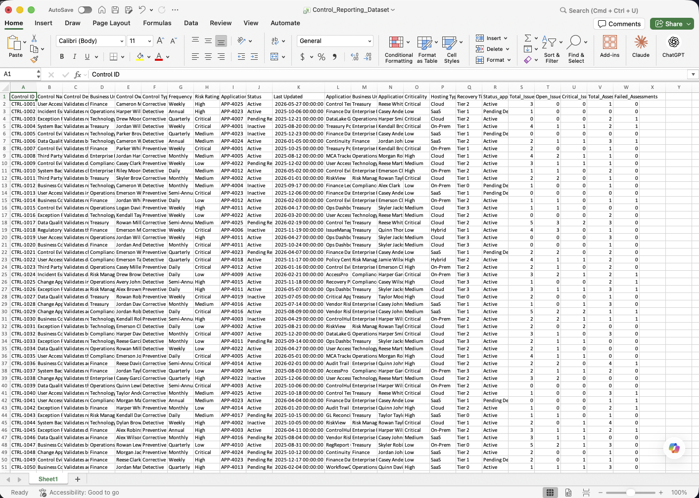

# Enterprise Reporting Automation Engine

An enterprise-inspired Python automation project that demonstrates data ingestion, validation, transformation, and reporting workflows commonly found in risk, controls, governance, and operational reporting environments.

Built to showcase software engineering, data engineering, and reporting automation concepts using a modular ETL architecture.

## Overview

The Enterprise Reporting Automation Engine is a Python-based automation solution that simulates a real-world enterprise reporting workflow. The application ingests multiple source datasets, validates data quality, applies business transformation rules, and generates reporting outputs suitable for operational and executive-level reporting.

This project demonstrates software engineering, automation, data engineering, and reporting concepts commonly used within large enterprise environments.

## Business Scenario

Organizations frequently maintain risk, control, assessment, issue, and application inventories across multiple reporting systems. Before meaningful reporting can occur, these datasets must be consolidated, validated, transformed, and standardized.

This project simulates that process by automating the ingestion, validation, transformation, and reporting lifecycle using Python.

## Project Objectives

* Automate ingestion of enterprise reporting datasets
* Validate source data quality and integrity
* Apply business transformation logic
* Generate clean reporting outputs
* Demonstrate modular software engineering principles
* Showcase ETL and reporting automation patterns

## Current Project Status

### Completed
* Project Planning
* Solution Design
* Environment Setup
* Data Ingestion Layer
* Data Validation Layer
* Referential Integrity Validation
* Data Transformation Layer
* Executive Reporting Workbook
* Exception Reporting
* Operational Logging
* Automated Validation Testing
* Technical Documentation

### In Progress
* Enhanced Test Coverage

### Planned
* SQL Database Integration
* Streamlit Dashboard
* REST API Integration
* CI/CD Pipeline
* Cloud Deployment

## Project Architecture

```text
data/raw
↓
run_pipeline.py
↓
data_validator.py
↓
transform_data.py
↓
generate_report.py
↓
Executive_Report.xlsx
```

## Solution Architecture



## Data Flow Diagram



### Generated Artifacts
- Executive_Report.xlsx
- Exception_Report.xlsx
- Validation_Test_Results.xlsx
- Control_Reporting_Dataset.xlsx
- pipeline_run.log

## Project Structure

```text
Enterprise Reporting Automation Engine
│
├── README.md
├── data
│   ├── raw
│   ├── processed
│   └── output
│
├── docs
│   ├── architecture
│   ├── screenshots
│   └── testing
│
├── logs
│
├── src
│   ├── ingestion
│   ├── validation
│   ├── transformation
│   ├── reporting
│   └── utils
│
└── tests
```
## Core Features

### Data Ingestion
* Multi-source file ingestion
* Excel-based source processing
* DataFrame creation and management
* File validation checks

### Data Validation
* Missing value detection
* Duplicate record detection
* Referential integrity validation
* Data quality reporting

### Data Transformation
* Data standardization
* Business rule implementation
* Dataset integration
* Metric calculations

### Reporting
* Executive reporting outputs
* Exception reporting
* Audit-friendly outputs
* Automated workbook generation

## Technology Stack

* Python
* Pandas
* OpenPyXL
* SQL
* Requests
* Streamlit
* GitHub
* PyCharm
* Visual Studio Code

## Scalability Considerations

The sample datasets used within this repository are intentionally smaller to improve readability and simplify portfolio review.

### Current Demonstration Dataset
* 50 Controls
* 100 Issues
* 75 Assessments
* 25 Applications

## Enterprise Considerations

The architecture has been designed to support significantly larger datasets through:

* Modular processing layers
* Reusable validation functions
* Extensible transformation logic
* Configurable reporting outputs
* Separation of concerns architecture

The design patterns used in this project mirror those commonly found in enterprise-scale reporting and automation solutions.

## Skills Demonstrated

### Software Engineering
* Modular Application Design
* Separation of Concerns
* Error Handling
* Project Architecture
* Version Control

### Data Engineering
* ETL Design Patterns
* Data Validation
* Data Transformation
* Referential Integrity
* Reporting Automation

### Business & Risk Domain Knowledge
* Risk Management
* Internal Controls
* Governance Reporting
* Data Quality Management
* Executive Reporting

## Future Enhancements

* SQL Database Integration
* REST API Integration
* Streamlit Dashboard Interface
* Configuration Management
* Automated Scheduling
* Cloud Deployment
* Unit Testing Framework
* CI/CD Integration

## How It Works

1. Load source files from the data/raw directory.
2. Convert source files into pandas DataFrames.
3. Execute validation checks.
4. Apply business transformation rules.
5. Generate reporting outputs.
6. Produce exception and audit reporting.

## Testing

### Testing Documentation

[View Testing Documentation](docs/testing/testing_documentation.md)

### Current Test Coverage
* Duplicate Row Detection
* No Duplicate Rows
* Missing Value Detection
* No Missing Values
* Invalid Control ID Detection
* No Invalid Control IDs
* Invalid Application ID Detection
* No Invalid Application IDs

### Generated Test Artifacts
- data/output/Validation_Test_Results.xlsx

## Operational Monitoring
* Pipeline execution logging
* Timestamped execution records
* Validation tracking
* Transformation tracking
* Report generation tracking
* Processed dataset tracking
* Audit-friendly log outputs

## Project Documentation

Additional project artifacts will be added as development progresses:

- Solution Architecture Diagrams
- Data Flow Diagrams
- Validation Reports
- Sample Output Workbooks
- User and Technical Guides
- Reporting Screenshots

## Visual Project Evidence

### Validation Test Results



### Executive Summary Tab



### Control Health Tab



### Exceptions Tab



### Exception Reporting Workbook



### Processed Reporting Dataset



## Disclaimer

All data used within this repository is fictional and intended solely for educational and portfolio demonstration purposes. No proprietary, confidential, or production data is included.